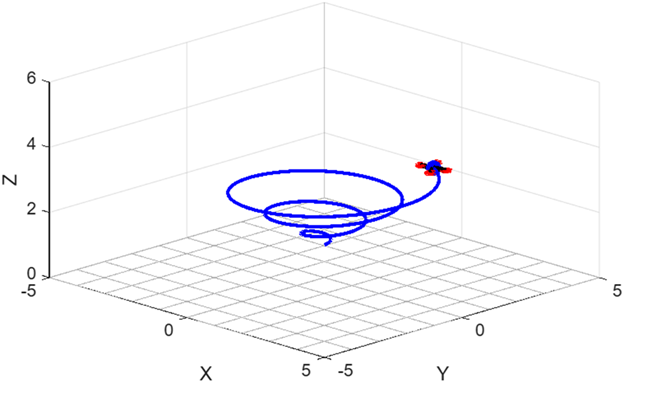

# Quadcopter Dynamics Simulation (MATLAB)

This project demonstrates a 3D quadcopter simulation developed in MATLAB.
The drone follows a spiral trajectory while displaying realistic orientation
changes and animated propeller rotation.

## Features

- 3D quadcopter visualization
- Spiral flight trajectory
- Roll, Pitch, Yaw orientation
- Animated propellers
- Ground reference grid

## Simulation Preview

## Files

| File | Description |
|-----|-------------|
| main_simulation.m | Main simulation loop |
| draw_drone.m | Quadcopter rendering and animation |

## Requirements

- MATLAB R2022 or later

## How to Run

1. Clone the repository
2. Open MATLAB
3. Run:
